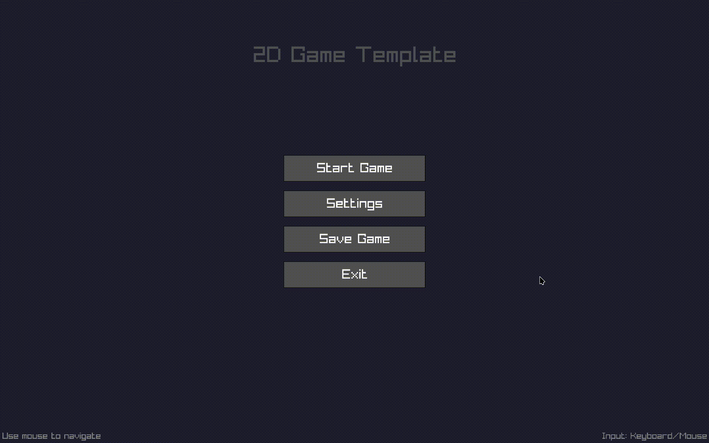

# 2D Game Template with SDL2 Controller Support

 [](https://isocpp.org/)   

A basic 2D game template built with raylib and SDL2 for reliable controller support. Features fullscreen scaling, a main menu, game states, and automatic save/load functionality.



## Features

- **Fullscreen Scaling**: Automatically scales UI and player movement to any resolution
- **Game States**: Menu, Playing, Settings, and Paused states
- **SDL2 Controller Support**: Reliable controller input using SDL2 (works with Xbox, DualSense, and other controllers)
- **Save/Load System**: Automatically saves player position, fullscreen state, FPS, and input mode
- **Cross-Platform**: Works on Linux, macOS, and Windows
- **Smart Input Switching**: Seamlessly switches between mouse, keyboard, and controller input

## Controller Support

The game uses SDL2 for controller input, which provides excellent compatibility with:
- Xbox controllers (Xbox One, Xbox Series X/S)
- PlayStation controllers (DualSense, DualShock)
- Generic gamepads
- And many other controllers

### Controller Controls

- **Left Stick**: Move player
- **D-pad**: Navigate menus (one press at a time)
- **A Button**: Select menu items
- **B Button**: Go back / Resume game
- **Start Button**: Pause/resume game
- **Back Button**: Return to main menu from pause
- **F1**: Toggle controller debug overlay

## Building and Running

### Prerequisites

#### Linux (Arch Linux)
```bash
sudo pacman -S raylib sdl2 gcc cmake
```

#### Linux (Ubuntu/Debian)
```bash
sudo apt install libraylib-dev libsdl2-dev g++ cmake
```

#### macOS
```bash
brew install raylib sdl2 gcc cmake pkg-config
```

If you encounter errors about missing libraries when running the game, try:

```bash
export DYLD_LIBRARY_PATH=/opt/homebrew/lib:$DYLD_LIBRARY_PATH
./game
```

All dependencies are installed via Homebrew. If you have issues with CMake not finding raylib or SDL2, ensure that pkg-config is installed and up to date.

#### Windows
1. Install [Visual Studio](https://visualstudio.microsoft.com/) or [MinGW](https://www.mingw-w64.org/)
2. Install [raylib](https://www.raylib.com/) development libraries
3. Install [SDL2](https://www.libsdl.org/) development libraries
4. Install [CMake](https://cmake.org/)

### Quick Start

```bash
# Clone the repository
git clone <repository-url>
cd raylib-template

# Build and run
./run.sh
```

### Manual Build

#### Using CMake (Recommended)
```bash
mkdir build
cd build
cmake ..
make
./game
```

#### Direct Compilation (Linux/macOS)
```bash
# Linux
g++ -o game main.cpp -lraylib -lSDL2 -lGL -lm -lpthread -ldl -lrt -lX11

# macOS
g++ -o game main.cpp -lraylib -lSDL2 -framework OpenGL -framework Cocoa -framework IOKit -framework CoreAudio -framework CoreVideo

# Run the game
./game
```

## Game Controls

### Keyboard/Mouse
- **WASD/Arrow Keys**: Move player
- **ESC**: Pause game / Go back from settings to main menu
- **Mouse**: Navigate menus
- **F1**: Toggle debug overlay

### Controller
- **Left Stick**: Move player
- **D-pad**: Navigate menus
- **A Button**: Select
- **B Button**: Go back / Resume game
- **Start Button**: Pause/resume
- **Back Button**: Return to main menu / Go back from settings to main menu

## File Structure

- `main.cpp` - Main game code with SDL2 controller support
- `run.sh` - Build and run script (Linux/macOS)
- `CMakeLists.txt` - Cross-platform CMake configuration
- `game_save.dat` - Save file (created automatically)
- `resources/` - Folder for all game assets (sounds, images, etc.)

## Assets/Resources

- All game assets (sounds, images, etc.) should be placed in the `resources` folder in the project root.
- The build system (CMake) automatically copies the `resources` folder next to the game executable after each build.
- When distributing or packaging your game, make sure to include the `resources` folder alongside your executable.

## Technical Details

### Input System
- Uses **raylib** for graphics, window management, and keyboard/mouse input
- Uses **SDL2** specifically for controller input
- Automatic input mode switching based on detected input
- Button press tracking prevents rapid-fire menu navigation
- Smart menu highlighting that switches between mouse hover and keyboard/controller selection

### Save System
- Player position stored as relative coordinates (0.0-1.0)
- Automatically recalculates position when window size changes
- Saves fullscreen state, target FPS, and input mode
- Save file located next to executable

### Scaling System
- UI elements scale with window size
- Player movement speed adapts to screen dimensions
- Consistent feel across different resolutions

## Troubleshooting

### Controller Not Detected
1. Ensure SDL2 is installed: `pacman -Q sdl2` (Arch) or `dpkg -l | grep sdl2` (Ubuntu)
2. Check controller permissions: `ls -la /dev/input/js*`
3. Add user to input group: `sudo usermod -a -G input $USER`
4. Reboot or log out/in

### Build Issues
- Ensure raylib and SDL2 development libraries are installed
- On Linux, you may need additional packages: `sudo pacman -S mesa glu` (Arch) or `sudo apt install libgl1-mesa-dev` (Ubuntu)
- Check that g++ supports C++17 or later
- On Windows, ensure all dependencies are in your PATH

### Performance Issues
- The game targets 120 FPS by default
- Adjust `targetFPS` in the code if needed
- Fullscreen mode may provide better performance

## Cross-Platform Compatibility

This template has been designed to work across all major platforms:

- **Linux**: Tested on Arch Linux with X11
- **macOS**: Compatible with macOS 10.14+ 
- **Windows**: Compatible with Windows 10/11

The CMake configuration automatically detects the platform and links the appropriate libraries.

### Linux Display Server Compatibility

#### X11 (Traditional)
- ✅ **Fully supported** - All features work perfectly
- ✅ **Controller support** - Reliable input detection
- ✅ **Fullscreen mode** - Works as expected

#### Wayland (Modern)
- ⚠️ **Limited support** - May encounter issues
- ⚠️ **Controller input** - Some controllers may not work properly
- ⚠️ **Fullscreen behavior** - May behave differently

**If you experience issues on Wayland:**

1. **Force X11 mode** (recommended):
   ```bash
   GDK_BACKEND=x11 ./game
   ```

2. **Force SDL2 X11 driver**:
   ```bash
   SDL_VIDEODRIVER=x11 ./game
   ```

3. **Use XWayland** (if available):
   ```bash
   # Run your desktop environment with XWayland enabled
   # Then run the game normally
   ```

**Why Wayland issues occur:**
- raylib/GLFW has limited Wayland support
- Controller input handling differs between X11 and Wayland
- Fullscreen and window management work differently

**Future improvements:**
- The template includes Wayland detection and will show helpful messages
- CMake configuration includes optional Wayland library linking
- Environment variable handling for better compatibility

## License

This template is provided as-is for educational and development purposes.

### Missing Assets?

If you see errors about missing files (e.g., `resources/click.wav`), make sure the `resources` folder exists next to your executable.  
CMake will copy it automatically when you build, but if you move the executable, copy the `resources` folder as well. 